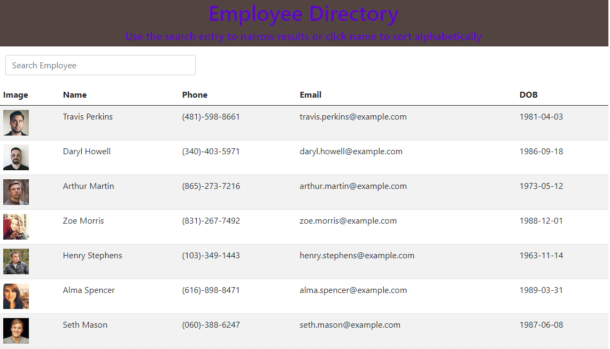

##Employee Tracker

# Description
This project uses React to generate a table with employee information with components using the Random User API

[Deployed Site](https://jennalala.github.io/employee-directory/)

Test Instructions
Installation
you can use my repo at https://github.com/jennalala/employee-directory, copy files and install dependancies

Usage
this shows you 20 random employees basic, nonsensitive informartion. You can filter employees in the search bar or place them in alphabetical order with the search button

Technology
React, components, axios, css, js
